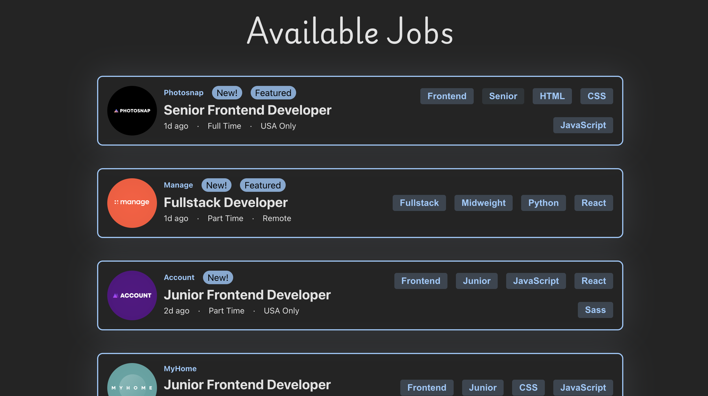
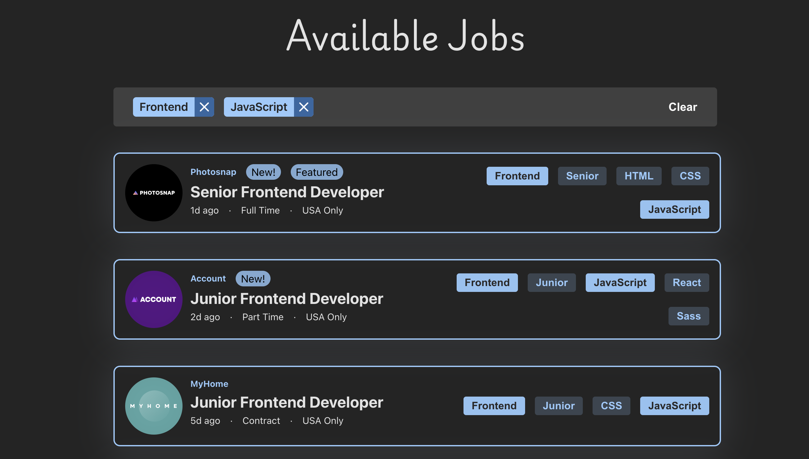
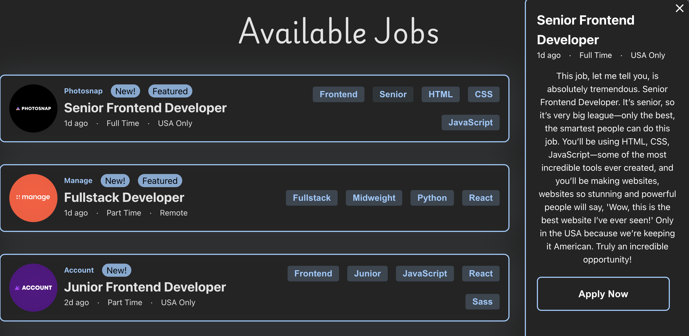

# Frontend Mentor - Job listings with filtering solution

This is a solution to the [Job listings with filtering challenge on Frontend Mentor](https://www.frontendmentor.io/challenges/job-listings-with-filtering-ivstIPCt/hub). Frontend Mentor challenges help you improve your coding skills by building realistic projects.

## Table of contents

- [Overview](#overview)
  - [Screenshots](#screenshot)
  - [Links](#links)
  - [Built with](#built-with)
  - [What I learned](#what-i-learned)
  - [Continued development](#continued-development)
- [Author](#author)

## Overview

I made this project to practice my budding React skills. I also used an Material UI for the drawer and used Framer motion (now Motion) for the animations.

### Screenshots

### Links

- Live Site URL: [Job Listings](https://job-listings-fem.netlify.app/)

### Built with

- [React](https://reactjs.org/)
- [Material UI](https://mui.com/material-ui/react-drawer/)
- [Motion](https://motion.dev/)

### What I learned

I learned a lot about breaking a website up into to components and how to manage state across those components.This was also tricky for me to do the CSS to get the drawer to cause everything else to translate to the right and handle the mobile view.

### Continued Development

I hope to build many more projects with React and improve my architecture, accessibility, clean code practices. I plan to learn Typescript, Testing, SCSS and Tailwind and try those in some upcoming projects. I also want to learn more about how to write efficient and maintainable React code and to better determine when effects and other hooks are actually needed or not.

## Author

- Website - [Visual Fraction Library](www.visualfractionlibrary.com) - I don't have a portfolio yet but this is my first portfolio project built in Vanilla JS.
- Frontend Mentor - [@mathematiCode](https://www.frontendmentor.io/profile/mathematiCode)
- BlueSky - [@math-coder](https://bsky.app/profile/mathcoder.bsky.social)
