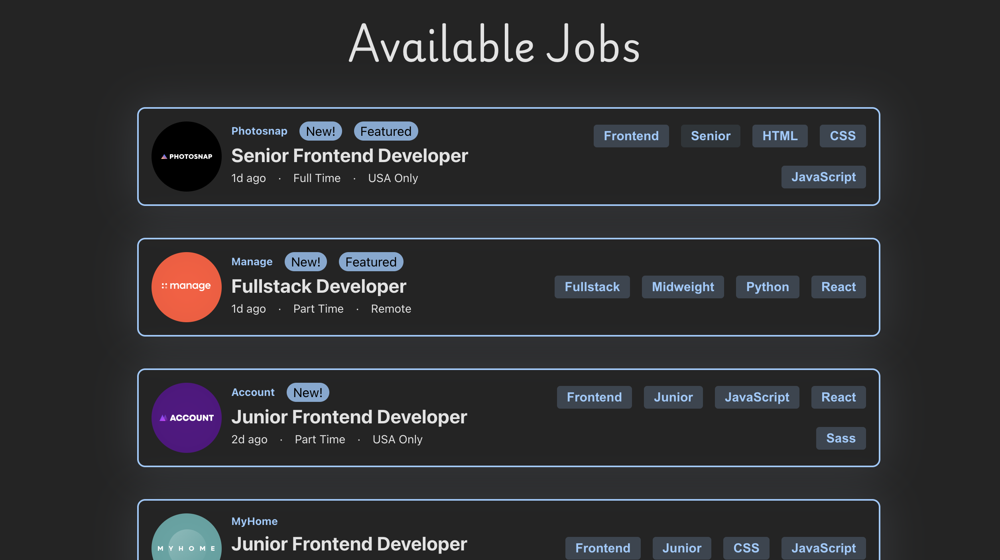
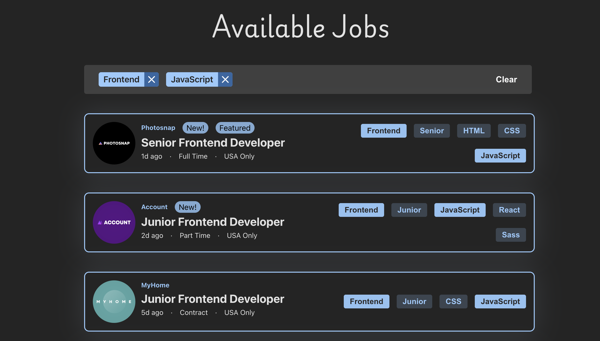
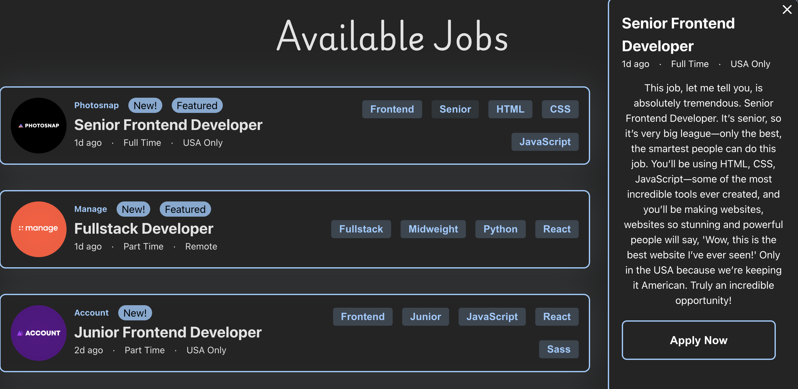

# Frontend Mentor - Job listings with filtering solution

This is a solution to the [Job listings with filtering challenge on Frontend Mentor](https://www.frontendmentor.io/challenges/job-listings-with-filtering-ivstIPCt/hub). Frontend Mentor challenges help you improve your coding skills by building realistic projects.

## Table of contents

- [Screenshots](#screenshot)
- [Deployed Site](#deployed-site)
- [Built with](#built-with)
- [What I learned](#what-i-learned)
- [Continued development](#continued-development)
- [Author](#author)
- [Installation and Build Instructions](#installation-and-running-instructions)

## Overview

I made this project to practice my budding React skills. I used Material UI for the side drawer and used Framer motion (now Motion) for the animations.

### Screenshots







### Deployed Site

[Job Listings](https://job-listings-fem.netlify.app/)

### Built with

- [React](https://reactjs.org/)
- [Material UI](https://mui.com/material-ui/react-drawer/)
- [Motion](https://motion.dev/)

### What I learned

I learned a lot about breaking a website up into to components and how to manage state across those components.This was also tricky for me to do the CSS to get the drawer to cause everything else to translate to the right and handle the mobile view. I also refactored this after I learned how to use context to separate the state logic from the components by keeping almost all of the functions that update the state variables inside of the context providers.

### Continued Development

I hope to build many more projects with React and improve my architecture, accessibility, clean code practices. I plan to learn Typescript, Testing, SCSS and Tailwind and try those in some upcoming projects. I also want to learn more about how to write efficient and maintainable React code and to better determine when effects and other hooks are actually needed or not.

## Author

- Website - [Visual Fraction Library](www.visualfractionlibrary.com) - I don't have a portfolio yet but this is my first portfolio project built in Vanilla JS. It generates scalable vector graphics for teachers and curriculum developers depicting fraction and mixed number multiplication and division with several different representations.
- Frontend Mentor - [@mathematiCode](https://www.frontendmentor.io/profile/mathematiCode)
- BlueSky - [@math-coder](https://bsky.app/profile/mathcoder.bsky.social)

## Installation and Running Instructions

1. **Prerequisites**: Ensure you have Node.js (version 18 or newer) installed on your machine.

2. **Clone the Repository**:

   ```bash
   git clone <your-repo-url>
   cd <your-project-directory>
   ```

3. **Start the Development Server:** Use the command below to start the Vite development server:

   ```
   npm run dev
   ```

4. **Access the Application:** Open your browser and navigate to http://localhost:5173 to view your application.

5. **Dependencies:** This project uses the following dependencies:

   - MUI: A popular React UI framework.
   - motion.dev: For animations and transitions.
   - lucide-react: A collection of icons for React.

6. **Building for Production:** When you're ready to build your application for production, run:

   ```
   npm run build
   ```

7. **Deployment:** The build output will be located in the dist directory, which you can deploy to your preferred hosting service.
